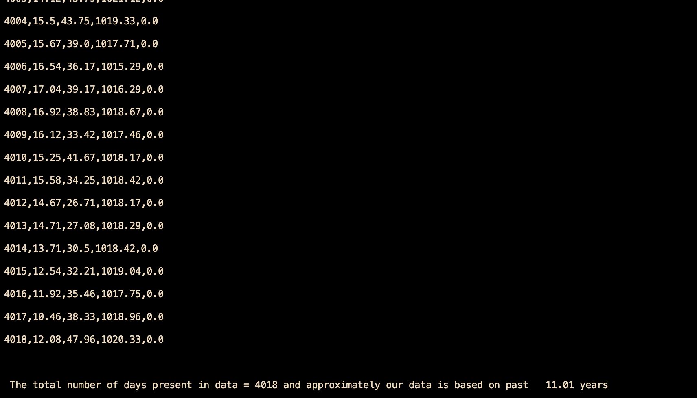

# 🌧️ Rain Probability Predictor using K-Nearest Neighbours (KNN)


---

## 📖 Overview

**Rain Probability Predictor** is a C-based weather prediction project that implements the **K-Nearest Neighbours (KNN)** algorithm completely from scratch.

Instead of using Machine Learning libraries such as Scikit-Learn, this project manually performs every step of KNN, including:

- Reading historical weather data
- Calculating Euclidean distances
- Finding the nearest neighbours
- Estimating rainfall probability

The program predicts the probability of rainfall based on **historical weather records** containing:

- 🌡️ Average Temperature
- 💧 Humidity
- 🌍 Atmospheric Pressure

This project was built as a learning exercise to understand the inner workings of KNN before using high-level Machine Learning frameworks.

---

# 📸 Demo

<p align="center">
    
</p>

---

# ✨ Features

✅ Reads weather data from CSV formatted text files

✅ Calculates Euclidean Distance for every historical record

✅ Implements the K-Nearest Neighbours algorithm from scratch

✅ Finds the **50 nearest neighbours (K = 50)**

✅ Estimates probability of rainfall

✅ Continuously accepts user inputs

✅ Built entirely using C

---

# 🧠 Algorithm

For every prediction, the program performs the following steps:

1. Read all historical weather records.
2. Compute Euclidean Distance between the input weather and every historical day.
3. Sort all distances in ascending order.
4. Select the closest 50 neighbours.
5. Count how many neighbouring days experienced rainfall.
6. Calculate the probability of rainfall.

---

# 📐 Euclidean Distance Formula

```
Distance =
√[(Temperature Difference)²
+ (Humidity Difference)²
+ (Pressure Difference)²]
```

---

# 📂 Dataset

The project uses approximately **4019 historical weather records**.

Each record contains:

| Field | Unit |
|--------|------|
| Day Number | Integer |
| Temperature | °C |
| Humidity | % |
| Pressure | hPa |
| Precipitation | mm |

Example CSV record:

```csv
1,35.42,42.31,1001.53,0.0
```

---

# ⚙️ Technologies Used

- C Programming
- Structures
- File Handling
- Arrays
- Sorting
- Euclidean Distance
- K-Nearest Neighbours (KNN)
- math.h

---

# 🚀 How to Run

### Clone the repository

```bash
git clone https://github.com/yourusername/Rain-Probability-Predictor.git
```

### Compile

```bash
gcc rain_prediction.c -o rain_prediction -lm
```

### Run

```bash
./rain_prediction
```

---

# 💻 Sample Output

```text
Enter the required day's average temperature:
31.4

Enter required day's humidity:
82

Enter required day's pressure:
996

The chances of precipitation based on input data is:

78.00%
```

---

# 📁 Project Structure

```
Rain-Probability-Predictor/
│
├── assets/
│   └── demo.png
│
├── rain_prediction.c
├── rain_history.txt
├── README.md
└── LICENSE
```

---

# 📈 Future Improvements

- [ ] Normalize weather features before distance calculation
- [ ] Replace O(n²) sorting with Merge Sort or Quick Sort
- [ ] Store neighbours using structures instead of parallel arrays
- [ ] Allow users to choose the value of K
- [ ] Predict rainfall amount instead of only probability
- [ ] Visualize weather trends
- [ ] Build a GUI version
- [ ] Create a web application version

---

# 📚 What I Learned

Through this project, I gained practical experience with:

- Reading CSV files in C
- File Handling
- Structures
- Euclidean Distance
- K-Nearest Neighbours (KNN)
- Sorting Algorithms
- Data Processing
- Statistical Prediction
- Building an AI-inspired project from scratch

---

# 🎯 Project Status

🟢 **Version 1.0 Completed**

This implementation successfully predicts rainfall probability using a manually implemented KNN algorithm in C.

Future versions will focus on improving prediction accuracy through feature normalization, weighted KNN, algorithm optimization, and performance evaluation.

---

# 👨‍💻 Author

**Harshvardhan Jha**

*"Building projects to understand how algorithms work under the hood before relying on libraries."*

---

### ⭐ If you found this project interesting, consider giving it a star!
